<p align="center">
  
</p>

<h1 align="center">ComfyUI-Usgromana-Gallery</h1>

<p align="center">
  
</p>

<p align="center">
  A gallery window for the images and videos ComfyUI writes, for people who browse, arrange, annotate, and send that media back into a workflow.
</p>

<p align="center">
  <a href="https://github.com/DayMan84/ComfyUI-Usgromana-Gallery/blob/main/pyproject.toml"></a>
  <a href="https://github.com/DayMan84/ComfyUI-Usgromana-Gallery"></a>
  <a href="https://github.com/DayMan84/ComfyUI-Usgromana-Gallery/stargazers"></a>
</p>

The extension sits over ComfyUI, reads the output folder, and keeps ratings, tags, comments, and shares beside the files. It does not add workflow nodes. Open it from the **Gallery** button.

## Grid and explorer

<table>
  <tr>
    <td width="33%" valign="top">
      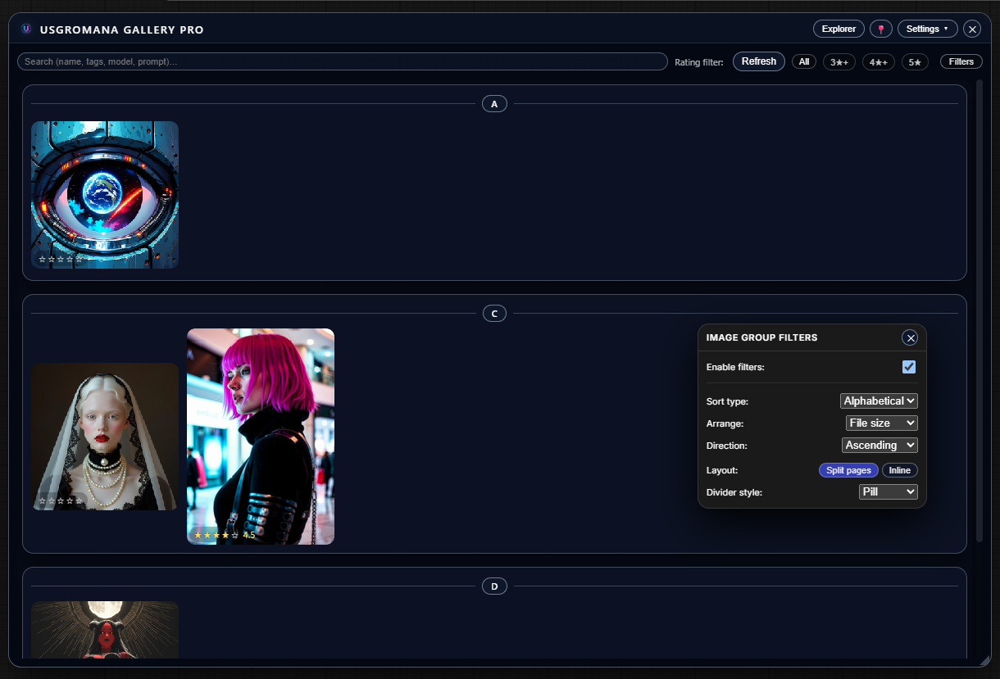
      <br />
      <sub>Thumbnail grid. Stars, search, and alphabetical dividers. The panel groups and sorts the library.</sub>
    </td>
    <td width="33%" valign="top">
      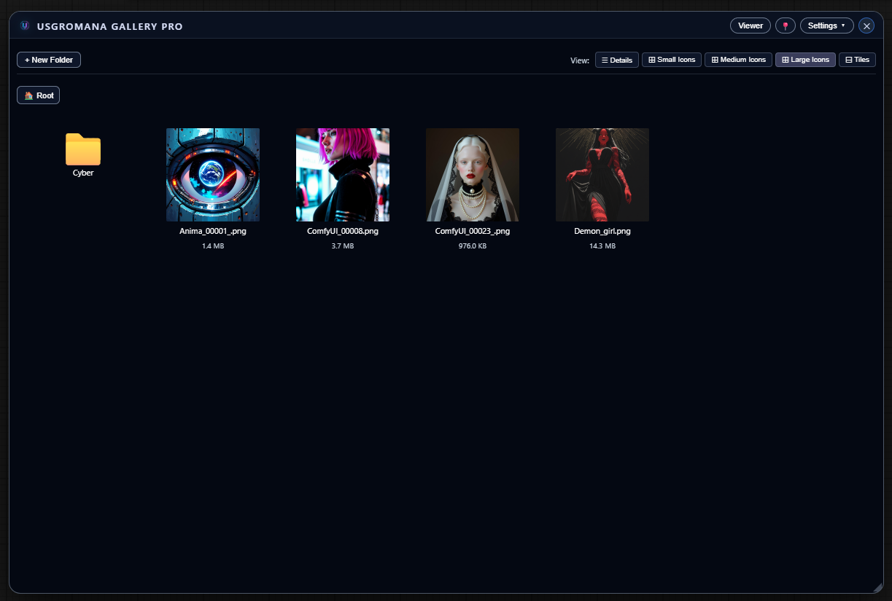
      <br />
      <sub>Explorer, large icons. Folders, filenames, and file size. Switch views from the header.</sub>
    </td>
    <td width="33%" valign="top">
      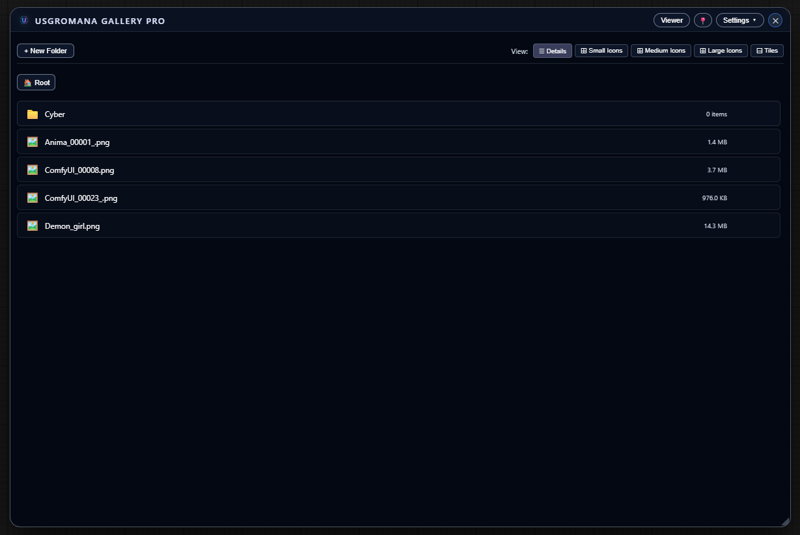
      <br />
      <sub>The same folder as a details list. Other views: small icons, medium icons, and tiles.</sub>
    </td>
  </tr>
</table>

Thumbnail size is small, medium, or large, with an optional masonry layout. Search matches filename, tags, model, or prompt. Rating filters are All, 3★+, 4★+, and 5★. Ctrl/Cmd-click selects several files, then download as a zip or delete them.

The header switches between **Explorer** and **Viewer**. Explorer has breadcrumbs, new folder, rename, and delete. Drag a file or folder onto a folder to move it. Double-click opens the preview.

## Preview

<table>
  <tr>
    <td width="33%" valign="top">
      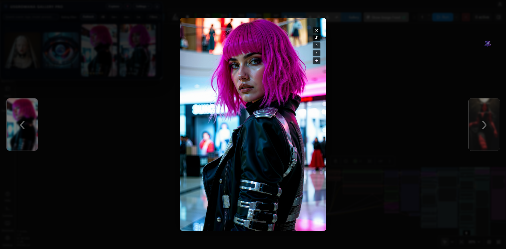
      <br />
      <sub>Large preview. Left and Right move through the current set. Side buttons show a blurred neighbor.</sub>
    </td>
    <td width="33%" valign="top">
      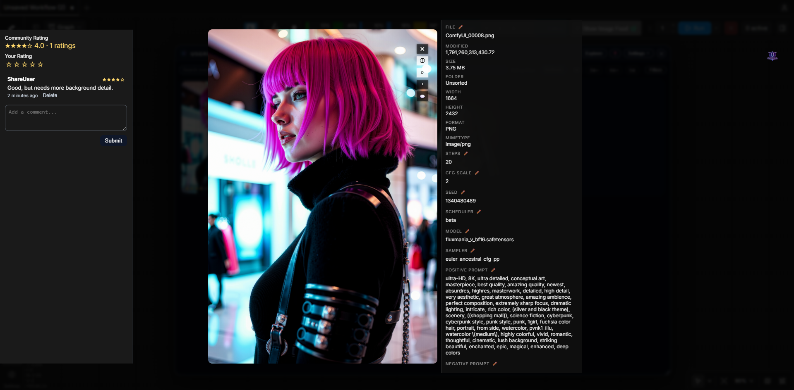
      <br />
      <sub>Information on the right, comments on the left. Escape closes the preview.</sub>
    </td>
    <td width="33%" valign="top">
      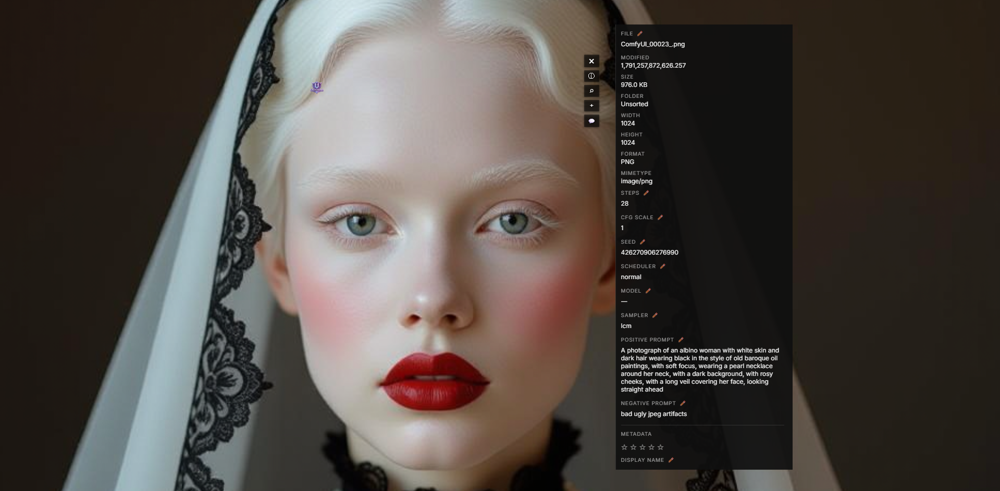
      <br />
      <sub>Zoom runs from 0.5× to 5× and follows the cursor. Drag to pan while zoomed.</sub>
    </td>
  </tr>
</table>

A video opens with controls and starts from the beginning. If the browser blocks autoplay with sound, playback retries muted. The preview card is resized to that video’s width and height, capped to the window. Neighbor buttons for videos use the generated poster, with the same blur as a photo.

The information panel shows file size, dimensions, format, modified time, and generation fields when the file has them (steps, CFG, seed, sampler, scheduler, model, prompts). Display name, tags, and the stored rating can be edited when the signed-in user is allowed to (`is_admin`, `can_edit`, or the `admin` group). Filename, generation fields, and **Delete Image** are shown for an admin or a user in the `admin` group. Rating, display name, and tags are also written into PNG text and XMP. JPEG embedding is limited.

Right-click an item for **Comments**, **Workflow**, and, on a file you own, **Remove**. **Share** is there when ComfyUI-Usgromana accounts are installed and you are signed in as someone other than guest.

The header pin centers the window on a dimmed backdrop, or leaves it floating so you can drag, resize, and click through to the workflow.

## Filters, themes, and the button

<table>
  <tr>
    <td width="33%" valign="top">
      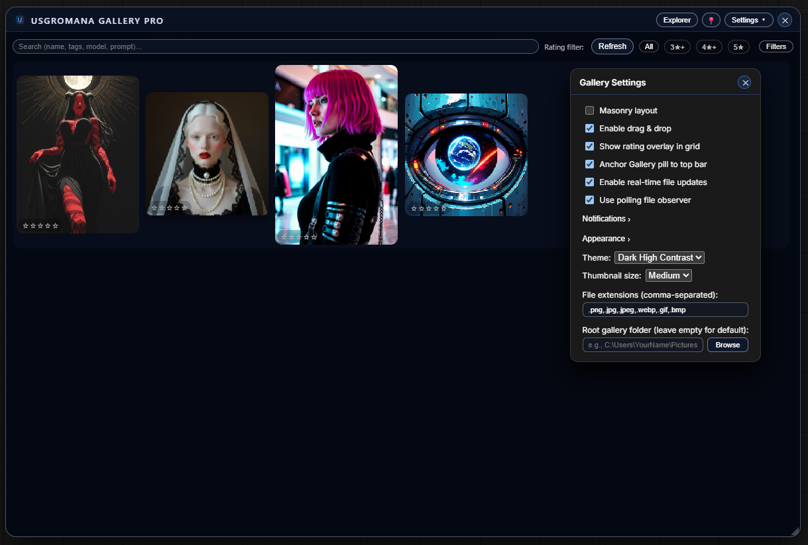
      <br />
      <sub>Settings for masonry, drag and drop, the rating overlay, the top-bar anchor, file watching, theme, and thumbnail size.</sub>
    </td>
    <td width="33%" valign="top">
      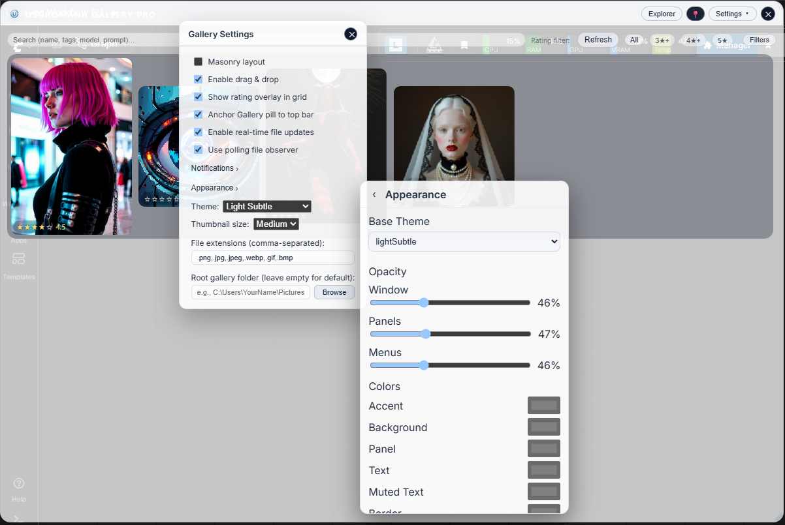
      <br />
      <sub>Appearance on Light Subtle. Opacity for window, panels, and menus, plus color overrides.</sub>
    </td>
    <td width="33%" valign="top">
      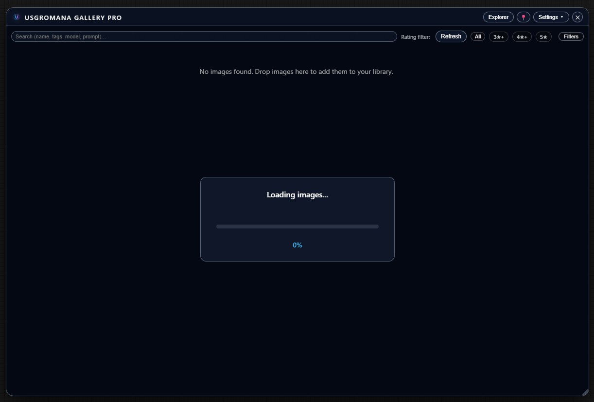
      <br />
      <sub>Drag a gallery image onto a ComfyUI node that accepts an image or file.</sub>
    </td>
  </tr>
</table>

The filter bar adds **Show: All / Photos / Videos** and a tag field. Video thumbnail mode and Gallery button size are further down Settings. None of those controls are in the shot above, and the extension field in that shot is an older list. Image group filters (the panel in the grid shot) stay off until **Enable filters** is checked.

| Control | What it does |
| --- | --- |
| Show | All, Photos, or Videos. Combines with search, rating, and tags. |
| Tags | Pick known tags, or type. A picked tag matches if the item has any of them. Typed text must appear inside a tag. Both apply together. |
| Sort type | None, alphabetical, folder, day, month, year |
| Arrange | None, name, time, file size, pixel count, rating |
| Direction | Ascending or descending |
| Layout | Split pages or inline |
| Divider style | Timeline, pill, label, or none |
| Video thumbnails | **Hover to animate** (default), **Always animated** (muted, restarts every 2 seconds), **Do not animate** |
| Gallery button size | 75–250%, in steps of 5. 100% is the original pill. |

**Hover to animate** keeps the poster until the pointer is over the cell, then plays the video muted in that cell and returns to the start when the pointer leaves. **Do not animate** stays on the poster.

The same percentage scales the Usgromana pinwheel hub and its fan, when that radial menu is on the page. Gallery is registered on the wheel when `UsgromanaRadialMenu` is present. **Anchor Gallery pill to top bar** hides the floating pill and uses a toolbar button instead. The pill and the toolbar button are not shown together. If the action bar is missing, the pill stays.

Six base themes: Dark, Dark High Contrast, Dark Subtle, Dark Blue, Light, Light Subtle. **Settings → Appearance** stores opacity and colors (accent, background, panel, text, muted text, border, buttons, danger, star) for the current user, with a contrast warning and **Reset Customizations**.

Other settings: masonry, drag and drop, rating overlay, real-time updates, polling observer, theme, thumbnail size, file extensions, and root gallery folder. The default extension list is `.png,.jpg,.jpeg,.webp,.gif,.bmp,.mp4,.webm`. mp4 and webm are scanned even when an older settings string omits them. A custom root is used only when it is the output directory or a folder inside it.

Dropping files onto the gallery accepts PNG, JPG, JPEG, WEBP, GIF, and BMP, up to 80 MB each. Videos show up from the output folder. They are not added through that drop.

## Sharing and notices

<table>
  <tr>
    <td width="33%" valign="top">
      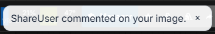
      <br />
      <sub>A toast beside the Gallery button. Click it to open that item’s comments.</sub>
    </td>
    <td width="33%" valign="top">
      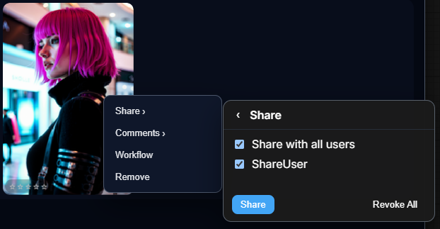
      <br />
      <sub>Share keeps the file in the owner’s folder and grants other accounts access.</sub>
    </td>
    <td width="33%" valign="top">
      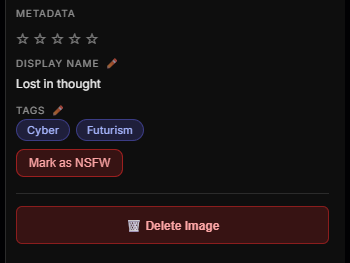
      <br />
      <sub>Tags render as pills. Display name, tags, and the stored rating can be edited.</sub>
    </td>
  </tr>
</table>

Comments can be up to 4,000 characters. You can edit your own. You can delete your own, and the owner can delete comments on that file. A new comment, or the first rating from someone else, can notify the owner. Your own actions do not. **Settings → Notifications** can turn notices off, or limit them to comments or ratings.

Without the Usgromana account extension, the gallery uses ComfyUI’s output folder and share stays hidden.

## Videos

mp4 and webm are listed beside still images. The server writes a PNG poster with ffmpeg, fitted within 256px, into `_thumbs` in the gallery root. If ffmpeg cannot read the file, the poster is a play icon. A cell can replace that poster with a frame captured in the browser.

Still-image thumbnails are PNGs from Pillow, also fitted within 256px, in the same `_thumbs` folder.

## In motion

These are the gallery UI, with fixture photos and videos behind it.

<table>
  <tr>
    <td width="33%" valign="top">
      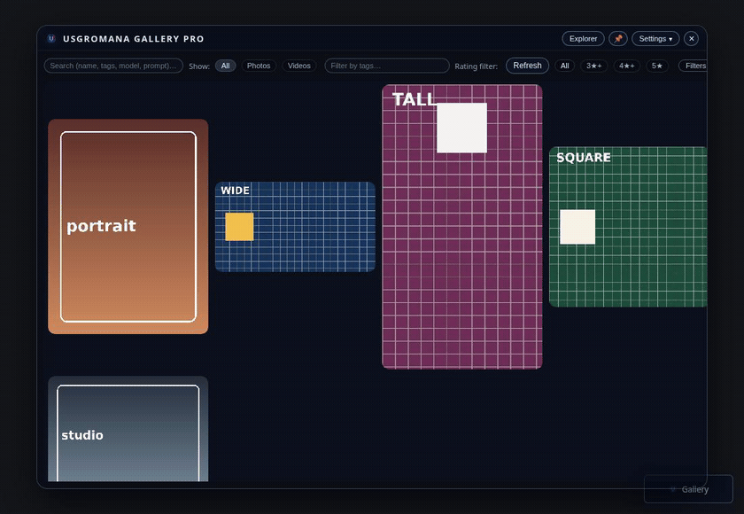
      <br />
      <sub>Hover plays the wide video in its cell. Leaving the cell returns the poster.</sub>
    </td>
    <td width="33%" valign="top">
      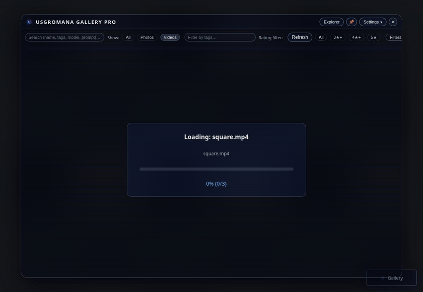
      <br />
      <sub>Show switches Videos, Photos, and All. The night tag then keeps the two tagged videos.</sub>
    </td>
    <td width="33%" valign="top">
      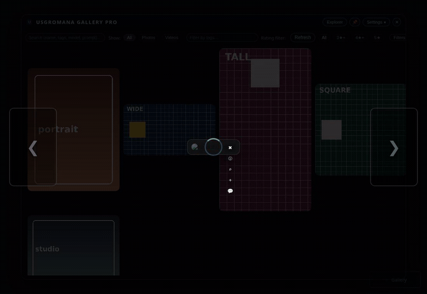
      <br />
      <sub>A tall video starts playing, and the card fits it. Side buttons use a blurred poster. Next opens the square video.</sub>
    </td>
  </tr>
</table>

<p>
  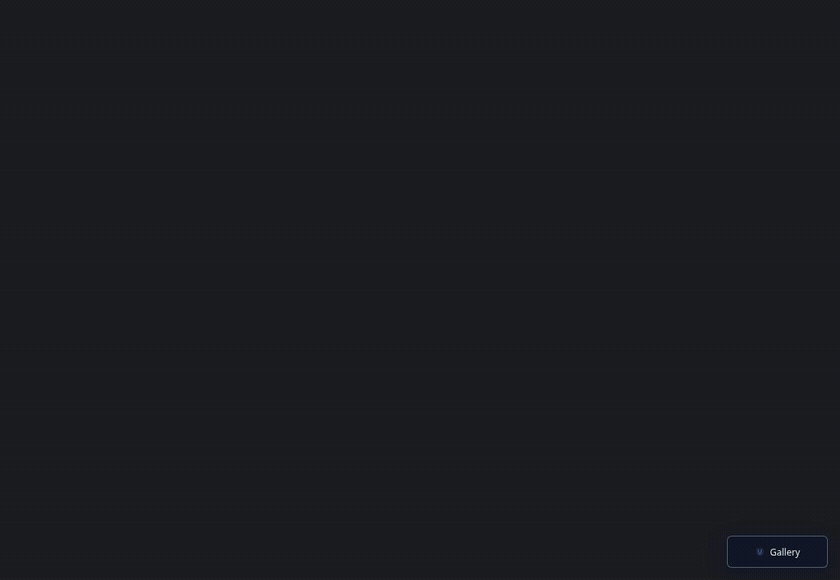
  <br />
  <sub>Gallery button size moves from 100% toward 250%. The floating Gallery pill grows with it.</sub>
</p>

The pinwheel fan is not in these clips. This plugin resizes Usgromana’s radial menu when that menu is already on the page. It does not draw the fan itself.

## Contents

- [Grid and explorer](#grid-and-explorer)
- [Preview](#preview)
- [Filters, themes, and the button](#filters-themes-and-the-button)
- [Sharing and notices](#sharing-and-notices)
- [Videos](#videos)
- [In motion](#in-motion)
- [Metrics](#metrics)
- [Install](#install)
- [Data](#data)
- [Shortcuts](#shortcuts)
- [If something looks wrong](#if-something-looks-wrong)
- [Disclaimer](#disclaimer)

## Metrics

| | |
| --- | --- |
| Version | 1.2.0, from `pyproject.toml` |
| License | No license file. GitHub reports the license as not specified. |
| Media | png, jpg, jpeg, webp, gif, bmp, mp4, webm |
| Posters | PNG, fitted within 256px, cached in `_thumbs` |
| Themes | 6 base themes, plus per-user color and opacity overrides |
| Nodes | None. The extension is a window, an API, and a file watch. |
| File watch | `watchdog>=3.0.0` for native events. Polling is the fallback. |

## Install

Clone into ComfyUI’s `custom_nodes` folder, install the file-watching dependency, and restart ComfyUI:

```bash
cd ComfyUI/custom_nodes
git clone https://github.com/DayMan84/ComfyUI-Usgromana-Gallery.git
pip install -r ComfyUI-Usgromana-Gallery/requirements.txt
```

`requirements.txt` lists `watchdog>=3.0.0`. ComfyUI already provides Pillow. Video posters use `ffmpeg` when it is on `PATH`. Without it, a video still gets a play-icon poster.

| Optional piece | Used for |
| --- | --- |
| ComfyUI-Usgromana (or a sibling `Usgromana` folder) | Per-account libraries, sharing, and the current-user API |
| That extension’s NSFW API | SFW filtering and manual NSFW marks |
| Its radial menu, when present | A Gallery entry on the wheel, scaled with the Gallery button |

Account features look for `Usgromana` or `ComfyUI-Usgromana` next to this extension, with `__init__.py` and `globals.py`. If the NSFW API is missing, the gallery still lists the library and skips that filter.

With real-time updates on, the server watches the library. `watchdog` supplies native events. Polling is used when that package is missing or **Use polling file observer** is on. The page refreshes the list about every two seconds while the watch is active.

## Data

```
ComfyUI-Usgromana-Gallery/
└── data/
    ├── metadata.json        # display names, tags, ratings, edited fields
    ├── ratings.json         # older rating file, merged when the gallery loads
    ├── settings.json        # gallery settings
    ├── image_shares.json    # share grants, created on first use
    └── gallery_social.db    # image identity, comments, community ratings, notices
```

Image and video files stay in the ComfyUI output folder, or the signed-in account’s output folder. Window position and a copy of settings also live in browser `localStorage`.

## Shortcuts

| Key | Action |
| --- | --- |
| ← / → | Previous or next item in the preview |
| Esc | Close the preview, a menu, or cancel an edit |
| Enter | Save the metadata field you are editing |
| Ctrl/Cmd+Enter | Save a comment edit |
| Ctrl/Cmd+click | Select or deselect items for download or delete |

## If something looks wrong

- **No Gallery button.** Restart ComfyUI and check the console for `[Usgromana-Gallery]`. The button is created by `web/js/usgromana_gallery.js`.
- **Empty grid.** Confirm files are in the output folder and that their extensions match the setting. mp4 and webm are included even when the saved extension list is older. A custom root only applies inside the output folder.
- **New files stay hidden.** Turn on real-time updates, or press Refresh. Install `watchdog` for native watching.
- **Video thumbnails stay on a play icon.** `ffmpeg` was not available, or it could not read that file.
- **Cannot edit metadata.** The information panel shows edit controls when `/usgromana/api/me` reports an admin, `can_edit`, or the `admin` group.
- **Sharing is missing.** ComfyUI-Usgromana accounts need to be installed, and the viewer needs to be signed in as a non-guest who owns the file.
- **NSFW marks fail.** That action needs the Usgromana NSFW API. Without it, the gallery skips NSFW filtering.

## Disclaimer

This repository does not include a license file. `pyproject.toml` names a `LICENSE` file, and that file is not in the tree. GitHub reports the license as not specified. This page does not grant one.

- Repository: [github.com/DayMan84/ComfyUI-Usgromana-Gallery](https://github.com/DayMan84/ComfyUI-Usgromana-Gallery)
- Issues: [github.com/DayMan84/ComfyUI-Usgromana-Gallery/issues](https://github.com/DayMan84/ComfyUI-Usgromana-Gallery/issues)
- Registry docs: [wiki](https://github.com/DayMan84/ComfyUI-Usgromana-Gallery/wiki)
