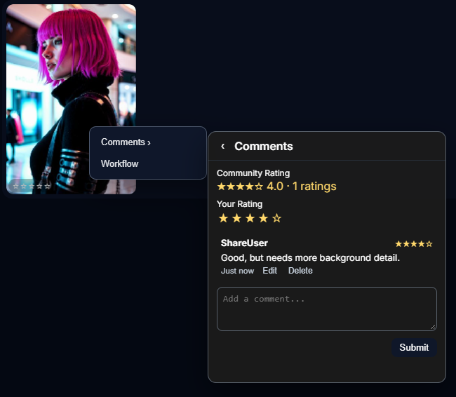

<p align="center">
  
</p>

<h1 align="center">ComfyUI-Usgromana-Gallery</h1>

<p align="center">
  A gallery for the images ComfyUI writes.<br/>
  Browse, arrange, annotate, and send them back into a workflow.
</p>

<p align="center">
  
</p>

The extension adds a gallery window over ComfyUI. It reads the output folder, shows thumbnails, and keeps ratings, tags, comments, and shares beside the files. It does not add workflow nodes.

Open it from the floating **Gallery** button. The button can sit in the ComfyUI action bar, and it can be dragged. When ComfyUI-Usgromana exposes its radial menu, Gallery is also registered there.

---

## Gallery

The default view is a thumbnail grid of images in the library root.

- Thumbnail size: small, medium, or large
- Optional masonry layout
- Optional star overlay on each card
- Search by filename, model, or prompt
- Rating filters: All, 3★+, 4★+, and 5★
- Refresh to rescan the folder
- Ctrl/Cmd-click to select several images, then download them as a zip or delete them

Stars on a card save a library rating. When an image has community ratings, the overlay shows that average.

<p align="center">
  
  
</p>

**Image group filters** group and sort the grid. The panel can be dragged.

| Control | Options |
| --- | --- |
| Sort type | None, alphabetical, folder, day, month, year |
| Arrange | None, name, time, file size, pixel count, rating |
| Direction | Ascending or descending |
| Layout | Split pages or inline |
| Divider style | Timeline, pill, label, or none |

Dividers stay off until **Enable filters** is checked.

## Explorer

Switch the header from **Explorer** to a folder browser, and back with **Viewer**.

- Views: Details, Small Icons, Medium Icons, Large Icons, Tiles
- Breadcrumbs for the current folder
- New folder, rename, and delete for files and folders
- Drag a file or folder onto another folder to move it
- Double-click an image to open the preview
- Image views show thumbnails

<p align="center">
  
  
</p>

## Preview

Click an image to open it large, with neighboring thumbnails on the sides.

- Left and Right move between images in the current set
- Escape closes the preview
- Zoom runs from 0.5× to 5× and follows the cursor
- When zoomed, drag to pan
- The information button opens file and generation metadata
- The comment button opens the comments drawer on the left

<p align="center">
  
</p>

<p align="center">
  
</p>

### Information panel

The panel shows what the file and its embedded metadata contain:

- Size, dimensions, format, and modified time
- Steps, CFG, seed, sampler, scheduler, and model, when those values are present
- Positive prompt, negative prompt, and the full prompt
- Display name, tags, and a stored star rating
- A content-warning badge when the image is marked NSFW

Tags render as pills. Display name, tags, and the stored rating can be edited when the signed-in Usgromana user is allowed to edit (`is_admin`, `can_edit`, or the `admin` group). Filename, generation fields, and **Delete Image** are shown for an admin user or a user in the `admin` group. Enter saves an edit. Escape cancels it.

Rating, display name, and tags are also written into PNG text and XMP so Windows file properties can read them. JPEG embedding is limited.

<p align="center">
  
</p>

## Right-click menu

Right-click an image in the grid or the explorer.

| Item | What it does |
| --- | --- |
| Comments | Community average, your 1–5 rating, and the comment thread |
| Workflow | Loads a workflow embedded in the image into the ComfyUI graph, then closes the gallery |
| Remove | Deletes an image you own, including its thumbnail |
| Share | Opens the share list for an image you own |

Share appears when ComfyUI-Usgromana accounts are installed and you are signed in as someone other than guest. Remove and Share are hidden for images that already live under `shared/`.

Comments can be up to 4,000 characters. You can edit your own comments. You can delete your own comments, and the image owner can delete comments on that image. Ctrl/Cmd+Enter saves a comment edit.

<p align="center">
  
  
</p>

### Sharing

Images stay in the owner’s folder. A share grants other accounts permission to see that file. The share panel lists accounts, and it can share with every other account or revoke every grant. Shared copies show up for the recipient under a `shared/` path.

Without the Usgromana account extension, the gallery keeps using ComfyUI’s output folder and the share controls stay hidden.

## Notifications

The gallery polls for notices about your images. A new comment, or the first rating from someone else, can notify the owner. Your own actions do not notify you, and changing a rating again does not send another notice.

Toasts stack beside the Gallery button and disappear after a few seconds. Click one to open that image’s comments. In Settings, **Notifications** can turn notices off entirely, or limit them to comments or ratings.

<p align="center">
  
</p>

## Window

The pin in the header switches how the gallery sits on the canvas.

- **Pinned:** centered, with a dimmed backdrop
- **Unpinned:** drag the header, resize from the corner, and click through the backdrop to the workflow underneath

Position, size, and pin state are remembered in the browser. The settings window and the filter panel can also be dragged.

## Appearance

Eight base themes ship with the gallery:

Dark · Dark Blue · Light · Midnight · Ocean · Forest · Rose · Sand

**Settings → Appearance** stores overrides for the current user on top of the base theme:

- Window, panel, and menu opacity
- Colors for accent, background, panel, text, muted text, border, buttons, danger, and star rating
- A contrast warning when text and background are hard to read
- **Reset Customizations**

<p align="center">
  
</p>

### Settings

| Setting | Effect |
| --- | --- |
| Masonry layout | Variable-height grid |
| Enable drag & drop | Drag images onto nodes, and drop files into the library |
| Show rating overlay in grid | Stars on each card |
| Anchor Gallery pill to top bar | Park the launch button in the action bar |
| Enable real-time file updates | Watch the library for new files |
| Use polling file observer | Poll the folder when native watching is off |
| Theme | One of the eight base themes |
| Thumbnail size | Small, medium, or large |
| File extensions | Defaults to `.png,.jpg,.jpeg,.webp,.gif,.bmp` |
| Root gallery folder | A folder inside the output directory. Leave empty for the output directory itself |

A custom root is used only when that path is the output directory or a folder inside it. Changing the root clears thumbnails cached for the previous root.

## Working with the canvas

**Drop files onto the gallery** to add them to the current library folder. PNG, JPG, JPEG, WEBP, GIF, and BMP are accepted, up to 80 MB each. The file is checked as an image, and a numbered name is used if that filename already exists. With accounts installed, you need to be signed in. Shared folders cannot be written this way.

**Drag a gallery image onto a ComfyUI node** that has an image or file input. Turn this off with **Enable drag & drop**.

<p align="center">
  
</p>

**Workflow** on the right-click menu reads workflow or prompt data stored in the image and loads it with ComfyUI. If neither is present, the gallery says so.

## NSFW filtering

If ComfyUI-Usgromana’s NSFW API is installed, the gallery uses it.

- Images, thumbnails, and zip downloads follow that user’s SFW rules
- The information panel shows a content warning when an image is marked NSFW
- An editor can mark an image NSFW from that panel

If the API is missing, the gallery still runs and lists the library without that filter.

## New images

With real-time updates on, the server watches the library. `watchdog` supplies native events. Polling is used when that package is missing or **Use polling file observer** is on. The page refreshes the image list about every two seconds while the watch is active.

Thumbnails are 256px PNGs cached in `_thumbs` inside the gallery root.

---

## Install

Clone the repository into ComfyUI’s `custom_nodes` folder:

```bash
cd ComfyUI/custom_nodes
git clone https://github.com/DayMan84/ComfyUI-Usgromana-Gallery.git
```

Install the file-watching dependency, then restart ComfyUI:

```bash
pip install -r ComfyUI-Usgromana-Gallery/requirements.txt
```

`requirements.txt` lists `watchdog>=3.0.0`. ComfyUI already provides Pillow.

### Optional

| Piece | Used for |
| --- | --- |
| ComfyUI-Usgromana (or a sibling `Usgromana` folder) | Per-account libraries, sharing, and the current-user API |
| That extension’s NSFW API | SFW filtering and manual NSFW marks |
| Its radial menu, when present | A Gallery entry on the wheel |

Account features look for `Usgromana` or `ComfyUI-Usgromana` next to this extension, with `__init__.py` and `globals.py`.

## Where data lives

```
ComfyUI-Usgromana-Gallery/
└── data/
    ├── metadata.json        # display names, tags, ratings, edited fields
    ├── ratings.json         # older rating file, merged when the gallery loads
    ├── settings.json        # gallery settings
    ├── image_shares.json    # share grants between accounts
    └── gallery_social.db    # image identity, comments, community ratings, notices
```

Image files stay in the ComfyUI output folder (or the signed-in account’s output folder). Window position and a copy of settings also live in browser `localStorage`.

## Shortcuts

| Key | Action |
| --- | --- |
| ← / → | Previous or next image in the preview |
| Esc | Close the preview, a menu, or cancel an edit |
| Enter | Save the metadata field you are editing |
| Ctrl/Cmd+Enter | Save a comment edit |
| Ctrl/Cmd+click | Select or deselect images for download or delete |

## If something looks wrong

- **No Gallery button.** Restart ComfyUI and check the console for `[Usgromana-Gallery]`. The launch button is created by `web/js/usgromana_gallery.js`.
- **Empty grid.** Confirm images are in the output folder and that their extensions match the setting. A custom root only applies inside that output folder.
- **New files stay hidden.** Turn on real-time updates, or press Refresh. Install `watchdog` for native watching.
- **Cannot edit metadata.** The information panel shows edit controls when `/usgromana/api/me` reports an admin, `can_edit`, or the `admin` group.
- **Sharing is missing.** ComfyUI-Usgromana accounts need to be installed, and the viewer needs to be signed in as a non-guest who owns the image.
- **NSFW marks fail.** That action needs the Usgromana NSFW API. Without it, the gallery skips NSFW filtering.

## Project

- Repository: [github.com/DayMan84/ComfyUI-Usgromana-Gallery](https://github.com/DayMan84/ComfyUI-Usgromana-Gallery)
- Issues: [github.com/DayMan84/ComfyUI-Usgromana-Gallery/issues](https://github.com/DayMan84/ComfyUI-Usgromana-Gallery/issues)
- Registry docs entry: [wiki](https://github.com/DayMan84/ComfyUI-Usgromana-Gallery/wiki)

This repository does not include a license file.
